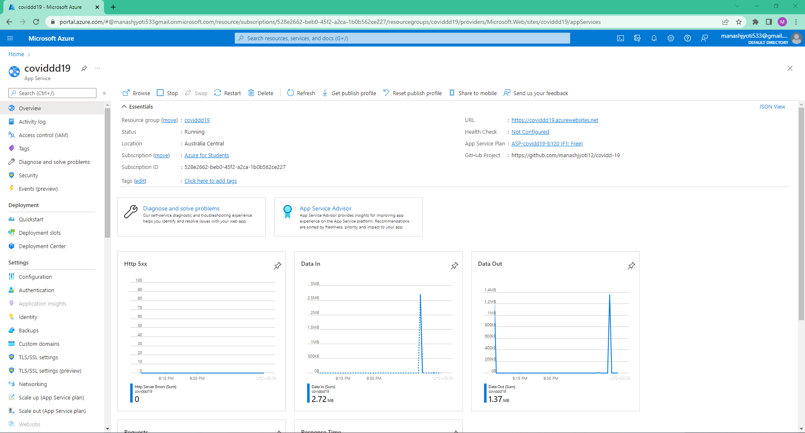
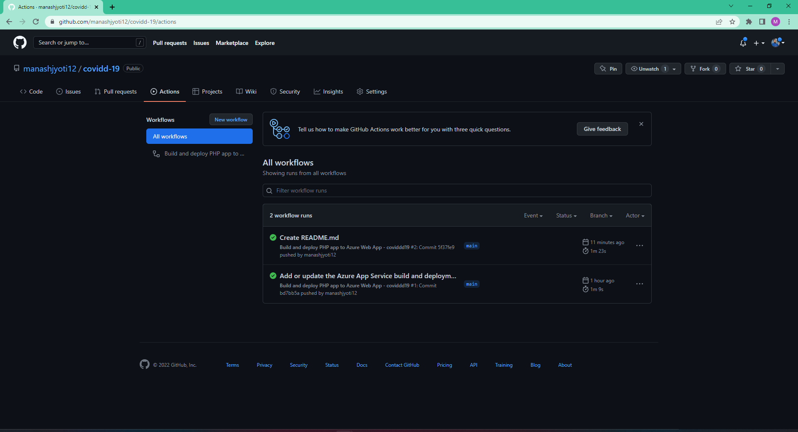

# Azure Chatbot: covid-19

## Problem Statement:

This web app allows the user to track the increasing number of coronavirus cases and get information through chat. With the spread of COVID-19 across the world, there is a sense of panic and uncertainty amongst the public. There is a need for health organizations to automate as many responses to these inquiries as possible to free up human resources to deal with more complex problems in the fight against this pandemic. 

## Project Description:

The web application is built on php which uses fetch api to collect the data and show. Primarily i am focusing to deploy this app in Azure so that people can directly use it from their phones and desktop. The chatbot is build using QnA maker. QnA Maker is a cloud-based Natural Language Processing (NLP) service that allows you to create a natural conversational layer over your data. It is used to find the most appropriate answer for any input from your custom knowledge base (KB) of information. With the help of Azure QnA maker we can prebuilt or upload the questionaries for our chatbot. Here, we've used Azure Bot Service to add chatbot to our google site. Hence with the help of above technologies we have integrated our chatbot to the google site which we have created.

## Primary Azure Technology

Azure Bot Service, Azure Cognitive Services, Azure static Web apps

## Project Link: https://covid-fr.azurewebsites.net/

##  GitHub repository: https://github.com/deka014/microsoft-FRT-project

## Project Demo Video: https://drive.google.com/file/d/1eoubDNe58q66iKT94bSKU8vbcTeJECII/view?usp=sharing

## Screenshots:

### website screenshot:

### Deployment using Web App screenshot:

### Github build succesful screenshot:

